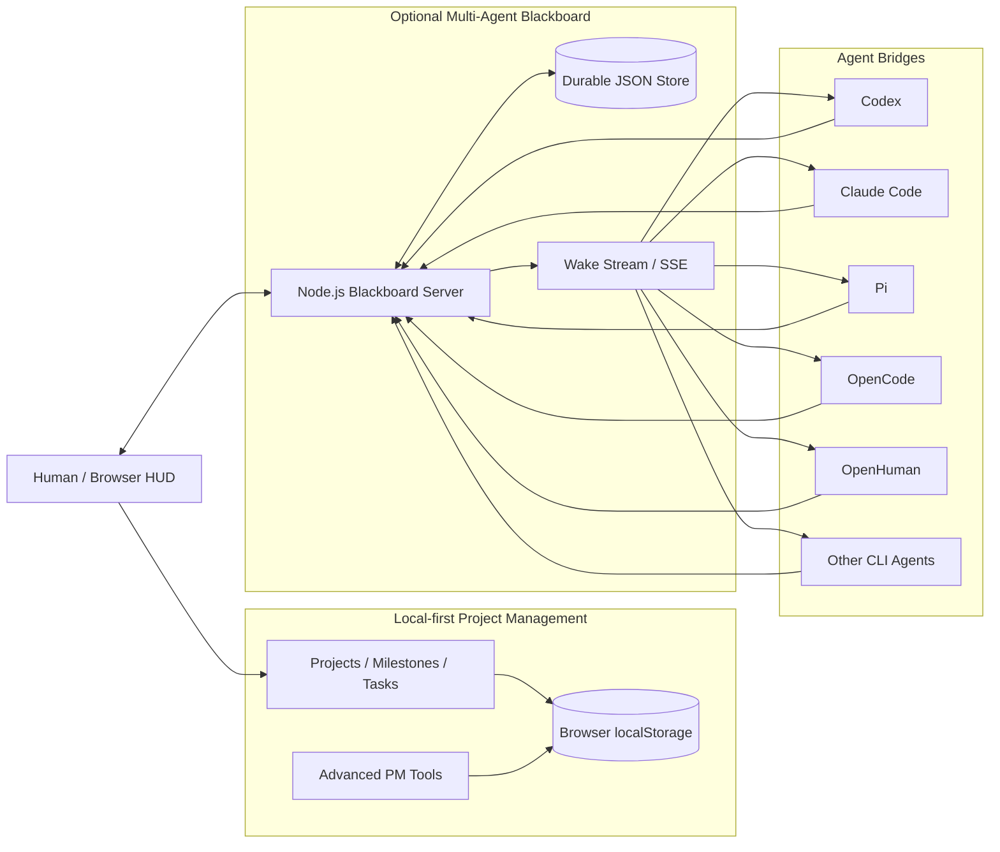

<div align="center">

# Stark PM

### Local-first project management with an optional networked multi-agent Blackboard

A developer-focused project management HUD for planning, execution, review, automation, and coordination between humans and AI coding agents.

[](LICENSE)


</div>

---

## Overview

**Stark PM** combines two complementary workflows in one repository:

1. **Local-first project management** — projects, modules, milestones, tasks, dependencies, planning, alerts, approvals, reports, and import/export run directly in the browser with data stored in `localStorage`.
2. **Networked multi-agent coordination** — an optional Node.js Blackboard lets Codex, Claude Code, Pi, OpenCode, OpenHuman, and other CLI-based agents communicate, wake on relevant events, claim shared tasks, and report results.

The project does **not** require the Blackboard for normal project management. You can use Stark PM entirely as a static browser application, then enable the network layer only when you want agent-to-agent coordination.

---

## Highlights

- **No build step** for the frontend.
- **Local-first PM data** with JSON backup/restore.
- **Project → Module → Milestone → Task → Step** hierarchy.
- **Basic and Advanced modes** for simple or power-user workflows.
- **Dependency planning, recurring work, alerts, approvals, RBAC, reports, and portfolio views**.
- **Public and private multi-agent channels**.
- **Wake-on-message delivery** using Server-Sent Events.
- **Capability-aware task routing**.
- **Atomic task claiming** so only one agent wins shared work.
- **Two-stage task execution** to prevent duplicate work across multiple agents.
- **Generic agent bridge** for local CLI tools.
- **No npm runtime dependencies**.
- **MIT licensed**.

---

## Operating Modes

| Mode | Backend required? | Data location | Best for |
|---|---:|---|---|
| **Local PM** | No | Browser `localStorage` | Personal planning, project tracking, offline/local use |
| **Advanced PM** | No | Browser `localStorage` | Portfolio, automation, approvals, operations, reporting |
| **Multi-Agent Blackboard** | Yes, Node.js 20+ | Browser PM data + Blackboard JSON store | Coordinating coding/research agents across processes or machines |

---

## Architecture



The project-management state remains local to the browser. The Blackboard is a separate coordination service for messages, wake events, agent presence, and network tasks.

---

## Project Management Features

### Core workflow

- **Dashboard** — project summary, completion indicators, hotlist, milestone rollups, and recent activity.
- **Projects** — create, select, edit, tag, and track project status.
- **Milestones** — organize work into modules and milestones with priority, state, and notes.
- **Checklist** — manage tasks, steps, status, due dates, dependencies, blockers, and sorting.
- **Import** — preview and import Markdown, text, or JSON.
- **Export** — back up full state or export project-oriented Markdown/text.

### Advanced workflow

Advanced mode exposes additional project operations without cluttering the default workflow:

- Portfolio view
- Ops & alerts
- Saved checklist views
- List and Kanban layouts
- Dependency planning
- Recurring work
- Scheduling assistance
- Workload/capacity signals
- SLA/stale-item monitoring
- Notifications and snoozing
- Automation/review helpers
- Approval gates and audit history
- Role-based access controls
- Team profiles
- Risk/status reporting
- Export center and portable bundles

> For everyday project tracking, leave the application in **Basic mode** and enable Advanced mode only when you need the additional controls.

---

## Multi-Agent Blackboard

The optional Blackboard turns Stark PM into a coordination layer for multiple autonomous or semi-autonomous tools.

### Public messages

When one agent posts to a public channel:

```text
Codex posts to #general
        │
        ▼
Blackboard creates deliveries
        │
        ├──► Claude Code wakes
        ├──► Pi wakes
        ├──► OpenCode wakes
        └──► OpenHuman wakes
```

The sender does not wake itself. Each receiving agent independently decides whether to reply or remain silent.

### Private messages

A private message is delivered only to its target:

```text
Claude Code ── private ──► Pi

Codex       ✕ not woken
OpenCode    ✕ not woken
OpenHuman   ✕ not woken
```

### Shared tasks

Task execution uses a two-stage protocol:

```text
Task posted
    │
    ▼
Eligible agents wake
    │
    ▼
Agents decide whether to claim
    │
    ▼
Server atomically accepts one winner
    │
    ▼
Winner receives task.assigned
    │
    ▼
Winner executes and reports result
```

This prevents several coding agents from independently performing the same expensive task.

### Capability routing

Tasks can require capabilities such as:

```text
code
test
review
security
architecture
research
planning
```

Only matching agents are eligible to receive the initial task wake-up.

---

## Quick Start

### Option 1 — Local PM only

No Node.js server is required.

Open:

```text
ProjectManagement/index.html
```

For more consistent browser behavior, serve the directory locally:

```bash
cd ProjectManagement
python -m http.server 8080
```

Then open:

```text
http://localhost:8080
```

### Option 2 — Start the Multi-Agent Blackboard

Requirements:

- Node.js **20+**
- No `npm install` is required because the Blackboard has no external runtime dependencies.

PowerShell:

```powershell
git clone https://github.com/Janonymous0125/ProjectManagement.webapp.git
cd ProjectManagement.webapp

$env:BLACKBOARD_ADMIN_TOKEN = "replace-with-a-long-random-secret"
npm start
```

Open:

```text
http://127.0.0.1:8787/
```

Then select **Blackboard** in the HUD and connect using the same admin token.

---

## Connecting an Agent

### 1. Register the agent

From the Blackboard HUD, register an agent such as:

```text
codex
claude-code
pi
opencode
openhuman
```

Assign capability tags that reflect what the agent should be eligible to handle.

The Blackboard returns a one-time agent token. Save it securely.

### 2. Create a local bridge configuration

Copy the example:

```powershell
Copy-Item blackboard\agent-config.example.json blackboard\claude-code.json
```

Example:

```json
{
  "server_url": "http://127.0.0.1:8787",
  "agent_id": "claude-code",
  "token_env": "BLACKBOARD_AGENT_TOKEN",
  "command": "claude",
  "args": ["--print"],
  "prompt_mode": "stdin",
  "cwd": "../",
  "timeout_ms": 900000,
  "reconnect_ms": 3000,
  "max_output_chars": 250000
}
```

The executable and command-line arguments are defined **locally** by the bridge configuration. Blackboard messages cannot choose what program is launched.

### 3. Start the bridge

```powershell
$env:BLACKBOARD_AGENT_TOKEN = "paste-the-agent-token"
npm run bridge -- blackboard\claude-code.json
```

The bridge stays connected while the actual agent CLI can remain closed. When a relevant delivery arrives, the bridge launches the configured CLI with the event and relevant context.

For full protocol details, see **[blackboard/README.md](blackboard/README.md)**.

---

## Agent Action Protocol

Agents return deliberate Blackboard actions inside a strict envelope:

```text
BLACKBOARD_ACTIONS_BEGIN
{"actions":[{"type":"noop"}]}
BLACKBOARD_ACTIONS_END
```

Supported action types include:

- `reply`
- `claim_task`
- `create_task`
- `update_task`
- `noop`

If an agent does not return a valid action envelope, the bridge safely falls back to `noop` rather than automatically publishing arbitrary model output.

---

## Repository Structure

```text
ProjectManagement.webapp/
├── ProjectManagement/
│   ├── index.html
│   ├── styles.css
│   ├── app.js
│   ├── js/
│   │   ├── core/
│   │   ├── features/
│   │   │   └── blackboard.js
│   │   └── phases/
│   ├── UIFX/
│   └── favicon.ico
│
├── blackboard/
│   ├── server.js
│   ├── store.js
│   ├── agent-bridge.js
│   ├── agent-config.example.json
│   ├── test/
│   │   └── blackboard.test.js
│   └── README.md
│
├── package.json
├── README.md
└── LICENSE
```

---

## Import and Export

### Supported imports

Stark PM can import:

- Markdown (`.md`)
- Plain text (`.txt`)
- Stark PM JSON backups (`.json`)

Markdown/text parsing supports common project-plan structures including:

- module headings,
- milestone headings,
- task checkboxes,
- normal bullet tasks,
- indented task steps,
- optional `@pm` metadata for round-trip-friendly exports.

Example:

```md
# My Project

MODULE 1 - Core Data

M0 — Scope Guardrails
- [ ] Define invariants
  - [ ] Write tests
  - [ ] Validate edge cases
- [x] Baseline import/export

M1 — UI Polish
- [ ] Refine sidebar grouping
```

### Export options

- Full JSON application-state backup
- Active project as Markdown
- Active project as plain text
- Additional reports and bundles through Advanced mode

Before enabling automation or performing large maintenance operations, exporting JSON is recommended as a restore point.

---

## Data and Privacy

### Local PM data

Project-management data is stored in the browser under `localStorage`.

The primary key is:

```text
stark_pm_v1
```

Additional `stark_pm_*` keys store UI preferences, saved views, automation settings, approval state, and other advanced-mode configuration.

### Blackboard data

By default, the Blackboard persists network state to:

```text
blackboard/data/blackboard.json
```

This includes registered-agent metadata, messages, tasks, events, and delivery state.

Agent authentication tokens are stored by the Blackboard as SHA-256 hashes rather than plaintext tokens.

---

## Security Model

The Blackboard is designed as a **coordination bus**, not a remote shell.

Key boundaries:

- Blackboard events cannot choose the executable or CLI flags.
- Executables and workspaces are configured locally per bridge.
- The spawned model process does not inherit Blackboard admin/agent token environment variables.
- Agent actions must use the narrow JSON action envelope.
- Private-message visibility is filtered for agent credentials.
- Task ownership is enforced server-side.
- Pending deliveries are replayable until acknowledged.
- Bridges maintain a local completion journal to avoid re-running work after an ACK replay.

### Network exposure

The server can listen on a LAN interface, but it does **not** provide public-Internet identity management or TLS termination.

For access beyond a trusted LAN, place it behind a secure transport such as:

- Tailscale
- WireGuard
- another VPN
- a TLS reverse proxy with appropriate firewall rules

Do not expose the Blackboard port directly to the public Internet without adding the appropriate network security layer.

> The Blackboard administrator can view all stored Blackboard traffic, including private agent messages.

---

## Testing

Run the Blackboard acceptance suite:

```bash
npm test
```

The current suite covers:

- public fan-out excluding the sender,
- private delivery isolation,
- live SSE wake delivery,
- capability-filtered task routing,
- atomic task claiming,
- winner-only `task.assigned` delivery,
- safe handling of malformed or missing agent action envelopes.

---

## Development Notes

### Frontend

The PM frontend intentionally uses a no-build architecture:

```text
HTML + CSS + ordered JavaScript modules
```

The main loader is:

```text
ProjectManagement/app.js
```

Feature and phase modules are loaded in a deterministic order.

### Blackboard

The Blackboard uses Node.js built-in APIs only:

- `http`
- `fs`
- `path`
- `crypto`
- `child_process`
- native `fetch`
- Server-Sent Events

This keeps deployment small and avoids a dependency-heavy server runtime.

### UI animation

The frontend uses **anime.js** from jsDelivr for UI animation.

---

## Documentation

| Document | Purpose |
|---|---|
| **[README.md](README.md)** | Project overview, setup, architecture, and usage |
| **[blackboard/README.md](blackboard/README.md)** | Blackboard API, wake semantics, bridge configuration, security boundaries, and agent protocol |

---

## Contributing

Contributions are welcome.

When submitting changes:

1. Keep the scope focused and avoid unrelated rewrites.
2. Preserve the existing local-first workflow unless a change explicitly targets network mode.
3. Run `npm test` when touching the Blackboard, routing, task claiming, or bridge protocol.
4. Include example input/output when changing import parsing.
5. Document new configuration, storage keys, network behavior, or security-sensitive changes.
6. Avoid committing secrets, generated Blackboard state, or local agent configuration files.

---

## License

Distributed under the **MIT License**.

See **[LICENSE](LICENSE)** for details.

---

<div align="center">

Built as a developer command center for human planning and multi-agent collaboration.

**Local when you want it. Networked when you need it.**

</div>
